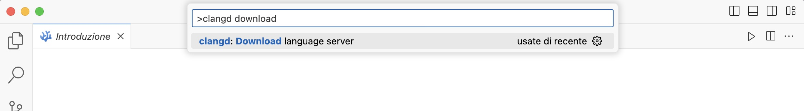

## Installazione del compilatore ``gcc``

Per ottenere il compilatore ``gcc`` è possibile installare attraverso il seguente comando:

```
$ sudo apt install gcc
```
Alternativamente, se ``gcc`` non fosse disponibile all'interno dei repository ufficiali della distribuzione utilizzare il seguente comando:

```
$ sudo apt install build-essential
```

## Installazione e configurazione VSCodium 

> **_NOTE:_**  *VSCodium* è una distribuzione con licenza libera dell'editor *VSCode* di Microsoft. *VSCode* contiene funzionalità di telemetria e tracciamento, quindi scegliere la versione da installare a propria discrezione. I due IDE sono equivalenti!

Per architetture ``x86_64``, è possibile scaricare il pacchetto ``.rpm`` o ``.deb`` (dipendentemente dalla distribuzione Linux utilizzata) [https://github.com/VSCodium/vscodium/releases](https://github.com/VSCodium/vscodium/releases) 

Per esempio, per Ubuntu e architettura x86_64 scaricare [https://github.com/VSCodium/vscodium/releases/download/1.81.1.23222/codium_1.81.1.23222_amd64.deb](https://github.com/VSCodium/vscodium/releases/download/1.81.1.23222/codium_1.81.1.23222_amd64.deb)

### Installare le estensioni C

Aprire VSCodium e installare l'estensioni **Code Runner** e **clangd** nella vista "Estensioni" (vedere nelle figure seguenti).


Una volta installate l'estensioni, configurare **Code Runner** in modo da utilizzare il terminale di default del proprio sistema operativo. A tale scopo, cliccare sul tasto impostazioni dell'estensione e poi *Impostazioni dell'Estensione (Extension Settings)*:

<p align="center">


</p>

Successivamente digitare "terminal" nella barra di ricerca e spuntare l'opzione "*Code-runner: Run in Terminal*".

<p align="center">


</p>

Una volta installata l'estensione *clangd* bisogna installare il **clangd server**. Per fare ciò, digitare Ctrl+Alt+P e cercare *clangd download server*, come mostrato in figura.

<p align="center">



</p>


Cliccare sulla voce per far partire l'installazione e ricaricare (quando richiesto) VSCodium. 


## Creazione del nostro primo programma (Hello World)

1. Creare una nuova cartella in una posizione qualunque
2. Aprire *VSCodium*, cliccare su ``Open Folder``, selezionare la cartella creata al punto 1.
3. Creare un nuovo file sorgente con estensione ``c`` (e.g., ``main.c``) e scrivere il seguente programma d'esempio:

	```[c]
	#include <stdio.h>
	
	int main(){
	
		printf("HELLO WORLD!!!\n");
		return 0;
	}
	```

4. Cliccare su ``Run`` e scegliere il compilatore ``gcc`` quando richiesto
5. Osservare l'output (la stringa ``HELLO WORLD!!!``) nel tab "Terminale"


