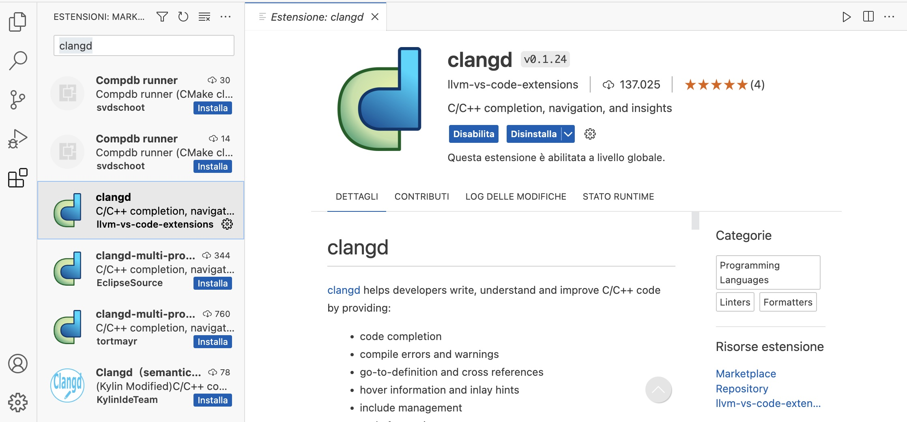

## Installazione di Xcode Command Line Tools (include il compilatore ``gcc``)

Eseguire il seguente comando:

```xcode-select --install```

Verrà aperto un pannello di richiesta, fare clic su `` Install``. Inizia lo scaricamento e l'installazione, alla fine verrà segnalata la terminazione della procedura, fare clic su ``Done``. Verificare l'installazione riprovando a eseguire da terminale il comando 
``gcc --version``. L'output similare a questo:

```
$ gcc --version                                 
Configured with: --prefix=/Library/Developer/CommandLineTools/usr --with-gxx-include-dir=/Library/Developer/CommandLineTools/SDKs/MacOSX12.3.sdk/usr/include/c++/4.2.1
Apple clang version 13.0.0 (clang-1300.0.27.3)
Target: x86_64-apple-darwin21.5.0
Thread model: posix
InstalledDir: /Library/Developer/CommandLineTools/usr/bin
```

Inoltre, controllare anche l'installazione del linker ``ld``:

```
$ ld -v                                                                                                                                                     
@(#)PROGRAM:ld  PROJECT:ld64-710.1
BUILD 08:20:20 Jul 19 2021
configured to support archs: armv6 armv7 armv7s arm64 arm64e arm64_32 i386 x86_64 x86_64h armv6m armv7k armv7m armv7em
LTO support using: LLVM version 13.0.0, (clang-1300.0.27.3) (static support for 27, runtime is 27)
TAPI support using: Apple TAPI version 13.0.0 (tapi-1300.0.6.5)
```


Si faccia riferimento alla guida ufficiale: [https://mac.install.guide/commandlinetools/4.html](https://mac.install.guide/commandlinetools/4.html)


## Installazione e configurazione VSCodium 

### Installare *VSCodium*

> **_NOTE:_**  *VSCodium* è una distribuzione con licenza libera dell'editor *VSCode* di Microsoft. *VSCode* contiene funzionalità di telemetria e tracciamento, quindi scegliere la versione da installare a propria discrezione. I due IDE sono equivalenti!


Per architettura ``x86_64``, è possibile scaricare il pacchetto ``.dmg`` [https://github.com/VSCodium/vscodium/releases/download/1.81.1.23222/VSCodium.x64.1.81.1.23222.dmg](https://github.com/VSCodium/vscodium/releases/download/1.81.1.23222/VSCodium.x64.1.81.1.23222.dmg) 

Per architettura ``M1/M2``, è possibile scaricare il pacchetto ``.dmg`` [https://github.com/VSCodium/vscodium/releases/download/1.81.1.23222/VSCodium.arm64.1.81.1.23222.dmg](https://github.com/VSCodium/vscodium/releases/download/1.81.1.23222/VSCodium.arm64.1.81.1.23222.dmg) 


### Installare le estensioni C 

Aprire VSCodium e installare l'estensioni **Code Runner** e **clangd** nella vista "Estensioni" (vedere nelle figure seguenti).




Una volta installate l'estensioni, configurare **Code Runner** in modo da utilizzare il terminale di default del proprio sistema operativo. A tale scopo, cliccare sul tasto impostazioni dell'estensione e poi *Impostazioni dell'Estensione (Extension Settings)*:

<p align="center">


</p>

Successivamente digitare "terminal" nella barra di ricerca e spuntare l'opzione "*Code-runner: Run in Terminal*".

<p align="center">


</p>

Una volta installata l'estensione *clangd* bisogna installare il **clangd server**. Per fare ciò, digitare *Command (or Cmd) ⌘ + Shift + P* e cercare *clangd download server*, come mostrato in figura.

<p align="center">


</p>


Cliccare sulla voce per far partire l'installazione e ricaricare (quando richiesto) VSCodium. 


## Creazione del nostro primo programma (Hello World)

1. Creare una nuova cartella in una posizione qualunque
2. Aprire *VSCodium*, cliccare su ``Open Folder``, selezionare la cartella creata al punto 1.
3. Creare un nuovo file sorgente con estensione ``c`` (e.g., ``main.c``) e scrivere il seguente programma d'esempio:

	```[c]
	#include <stdio.h>
	
	int main(){
	
		printf("HELLO WORLD!!!\n");
		return 0;
	}
	```

4. Cliccare su ``Run`` e scegliere il compilatore ``gcc`` quando richiesto
5. Osservare l'output (la stringa ``HELLO WORLD!!!``) nel tab "Terminale"


