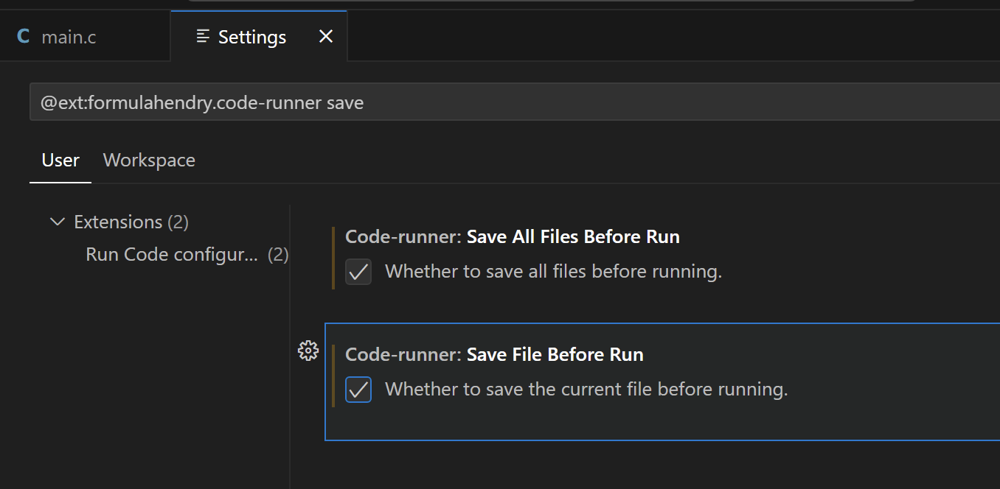
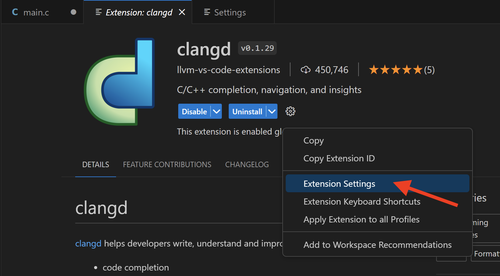
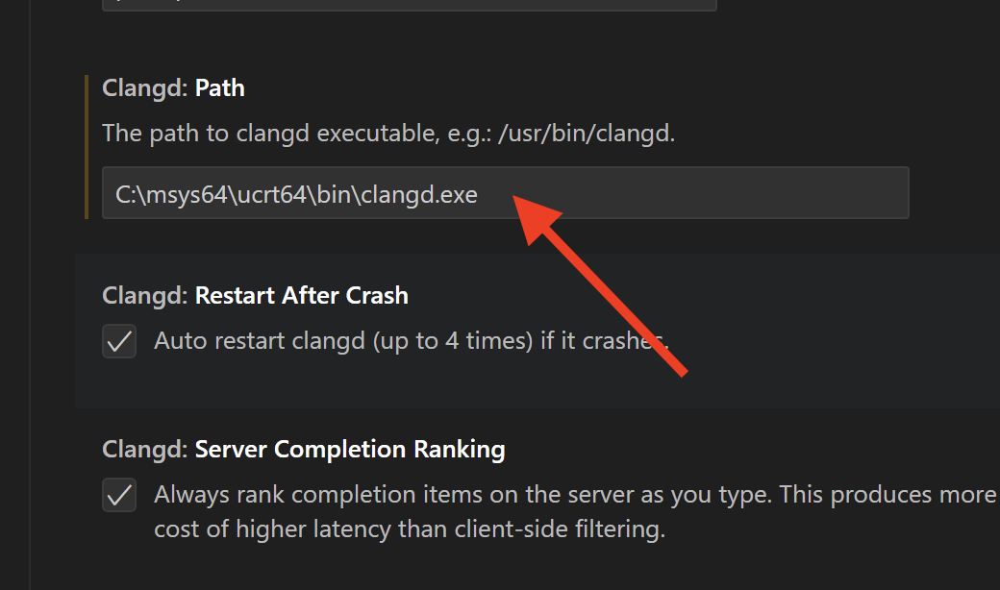

## Installazione della toolchain MinGW-64 (include il compilatore ``gcc``)

1. Scaricare e installare il pacchetto **MSYS2** (LINK: [https://github.com/msys2/msys2-installer/releases/download/2023-05-26/msys2-x86_64-20230526.exe](https://github.com/msys2/msys2-installer/releases/download/2023-05-26/msys2-x86_64-20230526.exe)). Nella fase finale, spuntare l'esecuzione
di *MSYS2* (``Run MSYS2 now``).

2. Si aprirà un terminale dove bisogna digitare i seguenti comandi:

	```
	pacman -S --needed base-devel
	pacman -S --needed mingw-w64-ucrt-x86_64-toolchain 
	pacman -S --needed mingw-w64-ucrt-x86_64-clang-tools-extra
	```

	scegliere l'opzione di default per tutti i pacchetti da installare (digitando INVIO), successivamente digitare ``Y``, quando richiesto, e poi INVIO.

3. Aggiungere la directory ``C:\msys64\ucrt64\bin`` (questo è il percordo di default) al ``PATH`` di sistema di Windows

	* Nella barra di ricerca, aprire le impostazioni e cercare ``Modifica variabili d'ambiente per l'account``

	* Nella sezione ``Variabili dell'utente per ...``, cliccare sulla variabile d'ambiente ``Path``, poi il tasto ``Modifica...``, successivamente il tasto ``Nuovo`` per aggiungere la variabile ``C:\msys64\ucrt64\bin``. Cliccare su ``Ok`` per rendere effettive le modifiche

4. Controllare se l'installazione del compilatore è andata a buon fine, digitando in un nuovo prompt di sistema ``gcc --version``. L'output dovrebbe mostrare, tra le altre informazioni, la versione del compilatore installata.

## Installazione e configurazione VSCodium 

### Installare *VSCodium*

> **_NOTE:_**  *VSCodium* è una distribuzione con licenza libera dell'editor *VSCode* di Microsoft. *VSCode* contiene funzionalità di telemetria e tracciamento, quindi scegliere la versione da installare a propria discrezione. I due IDE sono equivalenti! L'autocompletamento del codice attraverso l'uso delle estensioni disponibili non è attualmente supportato.

E' possibile scaricare l'installer di *VSCodium* utilizzando il seguente link:
[https://github.com/VSCodium/vscodium/releases/download/1.81.1.23222/VSCodium-x64-1.81.1.23222.msi](https://github.com/VSCodium/vscodium/releases/download/1.81.1.23222/VSCodium-x64-1.81.1.23222.msi)

### Installare le estensioni C 

Aprire VSCodium e installare l'estensioni **Code Runner** e **clangd** nella vista "Estensioni" (vedere nelle figure seguenti).


Una volta installate l'estensioni, configurare **Code Runner** in modo da utilizzare il terminale di default del proprio sistema operativo. A tale scopo, cliccare sul tasto impostazioni dell'estensione e poi *Impostazioni dell'Estensione (Extension Settings)*:

<p align="center">


</p>

Successivamente digitare "terminal" nella barra di ricerca e spuntare l'opzione "*Code-runner: Run in Terminal*".

<p align="center">


</p>

Inoltre, impostare le opzioni *Save All Files Before Run* e *Save File Before Run* come indicato nella seguente figura:

<p align="center">



</p>


Una volta installata anche l'estensione *clangd* bisogna specificare il percorso assoluto del **clangd server**, che di default è ``C:\msys64\ucrt64\bin\clangd.exe``. Impostare tale percorso come nelle seguenti figure.

<p align="center">



</p>

<p align="center">



</p>


Una volta impostato il Clangd Path riavviare VSCodium.


## Creazione del nostro primo programma (Hello World)

1. Creare una nuova cartella in una posizione qualunque
2. Aprire *VSCodium*, cliccare su ``Open Folder``, selezionare la cartella creata al punto 1.
3. Creare un nuovo file sorgente con estensione ``c`` (e.g., ``main.c``) e scrivere il seguente programma d'esempio:

	```[c]
	#include <stdio.h>
	
	int main(){
	
		printf("HELLO WORLD!!!\n");
		return 0;
	}
	```

4. Cliccare su ``Run`` e scegliere il compilatore ``gcc`` quando richiesto
5. Osservare l'output (la stringa ``HELLO WORLD!!!``) nel tab "Terminale"


